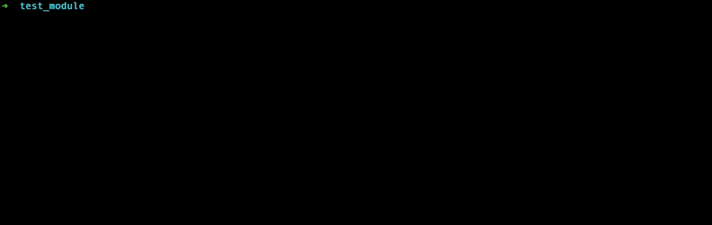

# Puppet Content Templates

* [Overview](#overview)
* [Installing](#installing)
  * [Unix Systems](#unix-systems)
  * [Windows Systems](#windows-systems)
* [Setting up Tab Completion](#setting-up-tab-completion)
* [Quick Start Guide](#quick-start-guide)
  * [Step 1: Create a Puppet Module](#step-1-create-a-puppet-module)
  * [Step 2: Add a New Class](#step-2-add-a-new-class)
  * [Step 3: Add a Github Actions Workflow](#step-3-add-a-github-actions-workflow)
* [Getting Started](#getting-started)
  * [pct new](#pct-new)
  * [Template Updates](#template-updates)
  * [Tab Completion](#tab-completion)
* [Writing Your Own Templates](#writing-templates)
  * [Dos and Don'ts](#dos-and-donts)
  * [Structure](#structure)
    * [pct-config.yml](#pct-configyml)
  * [Templating Language](#templating-language)
* [Overriding Template Defaults](#overriding-template-defaults)
  * [User level configuration](#user-level-configuration)
  * [Workspace configuration](#workspace-configuration)
* [Sharing Templates](#sharing-templates)
  * [pct build](#pct-build)
  * [Installing template packages](#installing-template-packages)
* [Request a feature](#request-a-feature)
* [Reporting Problems](#reporting-problems)

## Overview

Puppet Content Templates (PCT) codify a structure to produce content for any Puppet Product that can be authored by Puppet Product Teams or external users without direct help of the PDK team.

PCT can create any type of a Puppet Product project: Puppet control repo, Puppet Module, Bolt project, etc. It can create one or more independent files, such as CI files or gitignores. This can be as simple as a name for a Puppet Class, a set of CI files to add to a Puppet Module, or as complex as a complete Puppet Control repo with roles and profiles.

These are meant to be ready-to-run, which means they put everything needed for a user to run the project from the moment after creation. This solves the 'blank page' problem, where a few files are in place but the user does not know what the next steps are.

> :warning: PCT is currently in an EXPERIMENTAL phase and feedback is encouraged via [pdkgo/discussions](https://github.com/puppetlabs/pdkgo/discussions) and starting a `feedback` post.

## Installing

While the PCT is in early release, we provide an archive and a simple script to unpack it. When we move closer to a full release we will add a platform specific installer. Use the `install.[ps1|sh]` script, depending upon your OS:

### Unix Systems

```bash
curl -L https://pup.pt/pdkgo/install.sh | sh
```

### Windows Systems

```ps
iex "&{ $(irm https://pup.pt/pdkgo/install.ps1) }"
```

This will install the latest release of PCT to `~/.puppetlabs/pct`.


> :warning: If you do not use the install script and are extracting the archive yourself, be sure to use the fully qualified path to `~/.puppetlabs/pct` on *nix or `$HOME/.puppetlabs/pct` on Windows when you set your `PATH` environment variable.

## Setting up Tab Completion

After installation, we'd highly recommend setting up tab completion for your shell to ensure the best possible experience.

PCT has built in tab completion support for the following shells: `bash`, `zsh`, `fish` and `powershell`.

To view the install instructions, access the `--help` menu in `pct completion` and follow the instructions for your shell:


## Quick Start Guide

This quick start guide will show you how to:

* Create a "bare bones" Puppet module from the `puppet-module-base` project template
* Add a Puppet Class to the module
* Add a Github Actions Workflow to test the module against the currently supported Puppet versions

### **STEP 1:** Create a Puppet Module

Let's name our module `test_module` using the `-n` flag:


### **STEP 2:** Add a New Class

If we `cd` in to the module root dir, everything will get deployed with the correct layout:


### **STEP 3:** Add a Github Actions Workflow

Want to know what configurable parameters are availble for a template and their defaults?
Run `pct new --info <TEMPLATE_AUTHOR>/<TEMPLATE_ID>`:


We're happy with those defaults, so let's deploy this item.

Since we're outside the module root dir, we'll use the `-o` option to point at the root dir:


## Getting Started

The `$INSTALLATION_ROOT/templates` directory will be subsequently referred to as the **Default Template Location**.

Templates currently come in 2 flavours: `project` and `item`.

* A `project` is a template containing many files in a particular structure. They create a ready-to-run structure to start using a Puppet product. _These are great starting points._ You can create a boilerplate empty starter Puppet Module or a fully customized Puppet Module with specialized CI files and RSAPI providers.
* An `item` is a template that will supplement a project or existing content. These could be language features like a Puppet class or single files like a Git ignore file.

### pct new

PCT is available through the `pct new` command.

The `--list` or `-l` flag displays a list of locally available templates located in the **Default Template Location**. The list of templates is also available by calling `pct new` without flags.

``` bash
pct new
pct new --list
```

Example output:

```bash
           DISPLAYNAME          |   AUTHOR   |          NAME           |  TYPE
--------------------------------+------------+-------------------------+------
                                |            |                         |
  Bolt Plan                     | puppetlabs | bolt-plan               | item
  Bolt Project                  | puppetlabs | bolt-project            | project
  Bolt PowerShell Task          | puppetlabs | bolt-pwsh-task          | item
  Bolt YAML Plan                | puppetlabs | bolt-yaml-plan          | item
  Puppet Module Managed Gemfile | puppetlabs | git-attributes          | item
  Puppet Class                  | puppetlabs | puppet-class            | item
  Puppet Content Template       | puppetlabs | puppet-content-template | project
  Puppet Defined Type           | puppetlabs | puppet-defined-type     | item
  Puppet Fact                   | puppetlabs | puppet-fact             | item
  Puppet Module                 | puppetlabs | puppet-module           | project
  Puppet Resource API Provider  | puppetlabs | rsapi-provider          | item
  Puppet Resource API Transport | puppetlabs | puppet-transport        | item
```

Using the available templates above, its time to generate some content.

``` bash
pct new <author>/<template>
```

Replace `<author>` and `<template>` with the `author` and `name` of the template containing the content you want.

By default the `new <author>/<template>` function will use the directory name of your current working directory to "name" your new content.
To override this behaviour use the `--name` or `-n` flag.

``` bash
pct new <author>/<template> --name MyProject
```

By default the `new <author>/<template>` function will output the template content to the current working directory.
To override this behavour use the `--output` or `-o` flag.

``` bash
pct new <author>/<template> --output /path/to/your/project
```

> :memo: Not all templates require a `name`. If a template doesn't require one, providing a value to the `--name` parameter will have no effect on the generated content.

### Example workflows

``` bash
> cd /home/me/projects/MyBoltProject
> pct new puppetlabs/bolt-project
```

``` bash
> pct new puppet-module -n MyNewProject -o /home/me/projects/
> cd /home/me/projects/MyNewProject
> pct new puppetlabs/puppet-fact -n ApplicationVersion
> pct new puppetlabs/rsapi-provider -n Awesomething
> pct new puppetlabs/puppet-transport -n AwesomethingApi
```

### Template Updates

At this time `pct new` will **NOT** update existing code to a newer version of a template.

If you run a `pct new` command using a `project` template, the project will replace the content within the output directory with the template code.

If you run a `pct new` command using an `item` template, the item will suppliment the content within the output directory with the template code. If files / folders that are named the same as the template content already exist, it will overwite this content.

## Writing Templates

### Structure

A PCT is an archive containing a templated set of files and folders that represent a completed set of content. Files and folders stored in the template aren't limited to formal Puppet project types. Source files and folders may consist of any content that you wish to create when the template is used, even if the template engine produces just one file as its output.

### Location

You can specify the location of your templates using the `--templatepath` option:

```bash
pct new my-name/my-custom-project --templatepath /home/me/templates
```

### Composition

A PCT must contain a `pct-config.yml` in the root directory, alongside a `content` directory.

The `content` directory contains the files and folders required to produce the `project` or `item`.

To mark a file as a template, use the `.tmpl` extension. Templated files can also use the global variable of `{{pct_name}}` to access the input from the `--name` cli argument.

> :memo: Folders within the `content` directory can also use the `{{pct_name}}` variable

Example template file names:

``` bash
myConfig.json.tmpl
{{pct_name}}_spec.rb
```

> :memo: One, all or none of the files can be templated.

#### pct-config.yml

Format of pct-config.yml

``` yaml
---
template:
  id: <a unique name>
  author: <name|username|orgname|handle|etc>
  type: <'item' or 'project'>
  display: <a human readable name>
  version: <semver>
  url: <url to project repo>

<template parameters>
```

> :memo: Template `id` and `author` must not contain spaces or special characters. We recommend using a hyphen to break up the identifier.

Example pct-config.yml:

``` yaml
---
template:
  id: example-template
  author: myorgname
  type: project
  display: Example
  version: 0.1.0
  url: https://github.com/puppetlabs/example-template
```

Example structure for `example-template`:

``` bash
> tree ~/templates/example-template
/Users/me/templates/example-template
├── content
│   └── example.txt.tmpl
└── pct-config.yml
```

### Templating Language

PCT uses [Go's templating language](https://golang.org/pkg/text/template/#hdr-Actions).

Example pct-config.yml with parameters:

``` yaml
---
template:
  id: example-template-with-params
  author: myorgname
  type: project
  display: Example with Parameters
  version: 0.1.0
  url: https://github.com/puppetlabs/pct-example-with-params


example_params:
  foo: "bar"
  isPuppet: true
  colours:
  - "Red"
  - "Blue"
  - "Green"

```

In the above template `example-template-with-params` the parameters can be accessed in a `.tmpl` file like so:

``` go
{{.example_params.foo}}
{{.example_params.isPuppet}}
{{.example_params.colours}}
```

outputs:

``` text
bar
<no value>
[Red Blue Green]
```

As a template author you can chose your own parameters and parameter structure so long as it is [valid YAML](https://yaml.org/spec/1.2/spec.html). Then utilise the GO templating language to display or iterate over these.

For most templates, we believe that you can do most of the things you would want with these common template controls:

``` go
// Outputs the value of `foo` defined within pct.yml
{{.example_template.foo}}

// A conditional
{{if .example_template.isPuppet}}
 "boo :("
{{else}}
 "yay!"
{{end}}

// Loops over all "colours" and renders each using {{.}}
{{range .example_template.colours}} {{.}} {{end}}
```

For more examples look at the existing templates provided in the **Default Template Location**.

### Dos and Don'ts

* `project` templates should provide all the code necessary to create a project from scratch and no more.
* Do not include configuration files that can be added via an `item` template later by an end user, for example, CI job configuration.
* Templates should be self documenting to help guide new users on how to use the file that has been created.

## Overriding Template Defaults

Perhaps you use a template often and find that you set the same values over and over?
As a template user, you can choose to override the default values specified by a template author.

> :memo: To view the default parameters for a template run `pct new --info <TEMPLATE_ID>`.

To override these defaults you need to create a `pct.yml` containing the template id along with the values you wish to override.

Example:

``` yaml
example_template:
  foo: "wibble"
  isPuppet: false
  colours:
  - "Red"
  - "Blue"

another_template:
  key: "value"
```

> :memo: You don't need to override everything
>
> ``` yaml
> example_template:
>  isPuppet: false
> ```
>

### User level configuration

Placing a `pct.yml` within `$HOME/.pdk/` allows you to create global overrides. Everytime you generate content from a template the configuration will be used.

### Workspace configuration

You may also place a `pct.yml` within a workspace.

Running `pct new` within a directory makes the current working directory your workspace.
If you specify an `--outputdir` that location is your workspace.

The configuration specified in a workspace `pct.yml` will override any configuration found within the user level configuration at `$HOME/.pdk/pct.yml`

## Sharing Templates

After you've written your own template you may wish to share it with other members of your team or the wider Puppet community. Work is underway to improve this initial functionality.

### pct build

This command will attempt to package the current working directory. You can change the directory to pack by providing `--sourcedir`.

``` bash
pct build [--sourcedir <dir>][--targetdir <dir>]
```

The `build` command will ensure that the directory that you are attempting to package will produce a valid Puppet Content Template by looking for a `pct-config.yml` and a `content` directory.

The resulting `tar.gz` package will be created by default in `$cwd/pkg`. You can change the directory the package is created in by providing `--targetdir`.

### Installing template packages

Packages created using the `build` command can be installed by extracting the `tar.gz` into  the **Default Template Location**.

#### Local archive

Packages created using the `build` command can also be installed with the `pct install` command.

For example, this command:

```bash
pct install ~/my-template-1.2.3.tar.gz
```

Will install the template contained in `my-template-1.2.3.tar.gz` to the default template location.

#### Remote archive

Packages created using the `build` command can be automatically downloaded and extracted with `pct install` so long as you know the URL to where the archive is.

For example, this command:

```bash
pct install https://packages.mycompany.com/pct/my-template-1.2.3.tar.gz
```

Will attempt to download the PCT template from the specified url and then afterward install it like any other locally available PCT template archive.

#### Remote Git Repository

**Git** must be installed for this feature to work. The git repository must contain only one template and must be structured with the `pct-config.yml` file and the `content` directory in the root directory of the repository.

For more information on template structures see the [Writing Templates](https://github.com/puppetlabs/pdkgo#writing-templates) section in the `README`.

For example, this command:

```bash
pct install --git-uri https://github.com/myorg/myawesometemplate
```

This will attempt to clone the PCT template from the git repository at the specified URI and install to the default template location.

## Requesting a feature

Open a new feature request in our [Github discussion](https://github.com/puppetlabs/pdkgo/issues/new) page.

## Reporting Problems

If you're having trouble with the experimental PCT tool, please follow these instructions
to file an issue on our GitHub repository: https://github.com/puppetlabs/pdkgo/issues/new

Make sure to fill in the information that is requested in the issue template as it
will help us investigate the problem more quickly.
